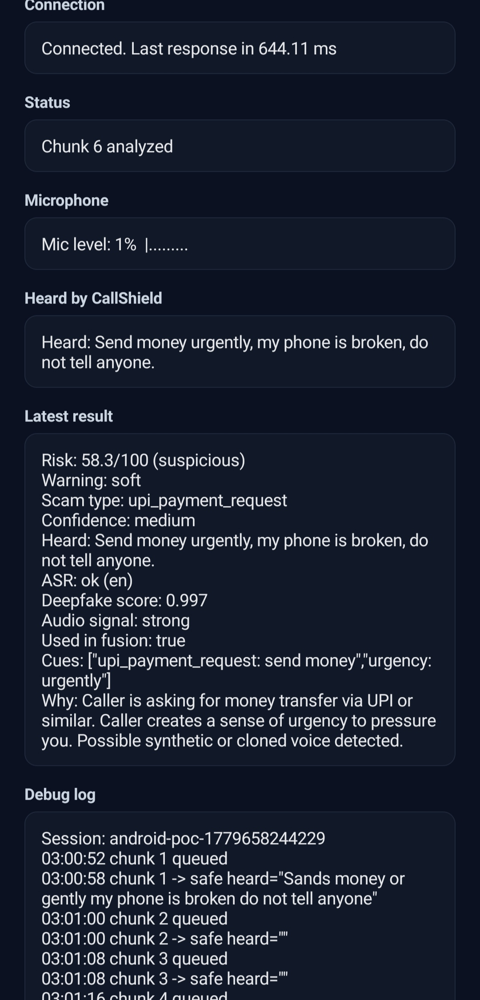
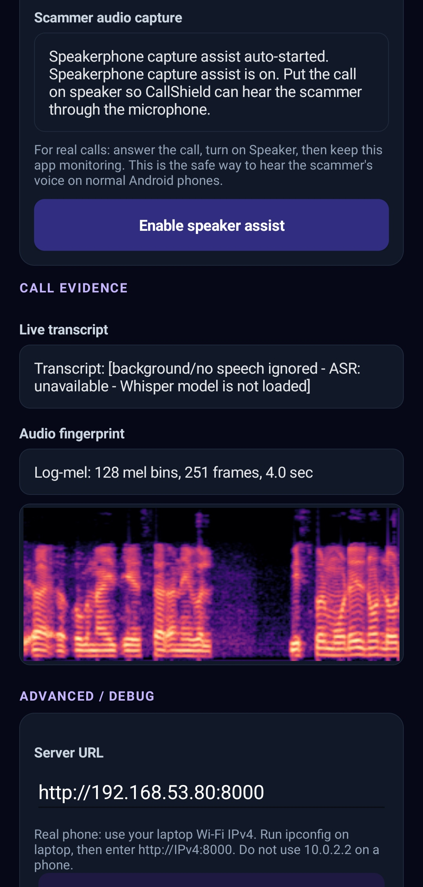

# CallShield AI

CallShield AI is a scam-call intelligence prototype that combines scam-language detection, ASR, calibrated audio deepfake detection, risk fusion, and an Android test app.

Full project documentation:

[Open the CallShield AI README](callshield-ai/README.md)

## Android APK

The Android APK is distributed through GitHub Releases instead of being committed to the repository.

[Download the latest Android APK](https://github.com/advit-s/CallShield/releases/latest/download/CallShieldMobile-Live-Test.apk)

Release asset expected:

```text
CallShieldMobile-Live-Test.apk
```

Local APK before upload:

```text
dist\CallShieldMobile-Live-Test.apk
```

The APK is a backend-connected test app. For full ASR, CNN deepfake inference, risk fusion, and log-mel spectrogram display, run the Python backend and enter the backend URL in the app. For remote demos, use a Cloudflare Tunnel URL.

## Run The Backend

```powershell
cd C:\Users\advit\OneDrive\Desktop\CallShield\callshield-ai
.\.venv\Scripts\python.exe main.py server
```

Dashboard:

```text
http://localhost:8000/demo
```

Cloudflare Tunnel:

```powershell
cd C:\Users\advit\OneDrive\Desktop\CallShield
.\cloudflared.exe tunnel --url http://localhost:8000
```

Use the generated base URL in the Android app, for example:

```text
https://YOUR-TUNNEL.trycloudflare.com
```

## Honest Status

CallShield is ready for controlled demos and technical walkthroughs. It is not yet production-validated on real phone-call audio, noisy WhatsApp/VoIP calls, or in-the-wild scam calls.

## Mobile Demo Screenshots

Screenshots from the Android test app connected to the local CallShield backend.

<p>
  
  
  
</p>
