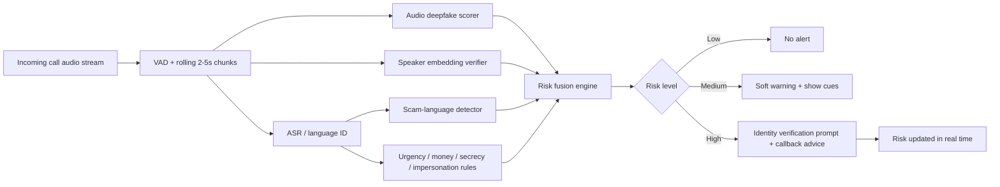

# CallShield AI

## Executive summary

**CallShield AI** is well-scoped for a hackathon if it is built as a **risk detector**, not as a single “deepfake yes/no” classifier. The strongest v1 is a **three-signal system** that continuously fuses: **audio deepfake detection**, **scam-language / social-engineering detection**, and **identity-verification prompts**. That architecture matches how real scams work: callers often combine impersonation, urgency, secrecy, alternate numbers, and immediate payment requests; and modern anti-spoofing research shows that channel effects, compression, and replay can badly degrade lab-trained detectors if telephony robustness is ignored. citeturn33search2turn33search5turn34view1turn35view0turn10search11turn17view2

The business and public-safety need is strong. In 2024, impersonation scams caused **$2.95 billion** in consumer losses reported to the FTC, and the FTC separately reported a more-than-four-fold rise since 2020 in older adults reporting impersonation losses of **$10,000+**; losses above **$100,000** among older adults rose from **$55 million** in 2020 to **$445 million** in 2024. FTC family-emergency guidance also describes the exact pattern your idea targets: “I’m in trouble, my phone is dead, I’m calling from another number, send money now.” Banks are now explicitly warning customers about AI-generated voice scams and urging out-of-band verification. citeturn34view1turn34view0turn33search2turn33search17turn2search5turn2search6

For a hackathon, the best technical choice is usually **telephony-aware audio modeling + small multilingual ASR + lightweight scam NLP + ECAPA-based speaker verification**, wrapped in a simple streaming API and demo UI. Public benchmarks such as **ASVspoof 2021** and **ASVspoof 5** are still the most credible starting points for spoof detection; **AASIST**, **RawNet2**, and **wav2vec 2.0**-based systems are the most practical baselines; **Whisper** or Whisper-derived features are strong for transcription and can also help downstream detection; and recent scam-call work shows that LLMs and rule-augmented systems are useful for **early warning**, **crime-script inference**, and **evolving-scam generalization**. citeturn35view0turn22view1turn7search0turn7search1turn9search0turn24search0turn26view0turn26view1turn26view3

**Recommended hackathon posture:** treat every model output as a **risk contribution**, not a final verdict. The system should **warn**, **ask for verification**, and **log evidence**; it should not autonomously accuse, block, or label a caller as a criminal. That is both technically safer and more defensible under privacy, fairness, and false-positive constraints. Recent robustness work also supports this cautious design: detector quality drops sharply under compression, realistic presentation, replay, and other communication distortions. citeturn10search11turn24search14turn10search7turn7search9

**Assumptions for this report**

- Team size, compute budget, and telephony provider are unspecified, so I assume a small hackathon team with access to one decent laptop or one cloud GPU and freedom to choose a browser app, desktop app, or SIP/demo backend.
- I assume the goal is a **demoable MVP**, not production-grade legal/compliance deployment.
- I assume the preferred user context includes English and Hindi / Hinglish in entity["country","India","south asia"]-style call scenarios.

## Problem scope and real-world impact

The most relevant fraud class for CallShield AI is **impersonation-driven scam calling**: family-emergency fraud, fake bank-account compromise, fake government/security alerts, tech-support compromise, and job / delivery / recruiting scams. The FTC describes impostor scams as one of the top fraud categories, and its guidance repeatedly highlights **caller-ID spoofing**, **fake urgency**, **money transfer instructions**, and **secrecy from family** as core tactics. Recent scam-call NLP papers add an important observation: scam narratives evolve quickly, so a detector must focus on **behavioral patterns** and **crime scripts**, not just memorised keywords. citeturn34view1turn33search5turn33search2turn33search17turn26view1turn26view3

The attack workflow is usually simple but psychologically effective. The attacker first establishes authority or familiarity, then creates urgency, then disables verification, and finally pushes the victim toward an irreversible payment rail or confidential disclosure. FTC examples and bank security pages show variants such as “your account is compromised,” “your relative was arrested,” “you must move money to keep it safe,” or “do not call back because the phone is dead / monitored.” Chase also warns that scammers can clone voices from publicly shared audio clips, which makes **identity cues** less trustworthy unless the system adds **speaker verification** and **dynamic challenge prompts**. citeturn34view0turn33search2turn2search5turn2search6turn10search3

| Fraud pattern | Typical hook | High-value signals for CallShield AI | Why it matters |
|---|---|---|---|
| Family emergency / relative-in-trouble | “I’m using another phone; send money now” | familiar-voice claim, alternate number, urgency, secrecy, direct money request | Classic target pattern for your idea; common enough that FTC has dedicated guidance. citeturn33search2turn33search17 |
| Bank / payment impersonation | “Your account is compromised; move money to safe account” | bank/entity mention, account compromise narrative, transfer request, “safe account” phrasing | FTC says these scams drove very large losses, especially for older adults. citeturn34view0turn34view1 |
| Government / law-enforcement impersonation | “Your ID is used in crime / warrant / customs case” | authority terms, legal threat, immediate compliance pressure | Major FTC enforcement focus under the impersonation rule. citeturn34view1 |
| Tech-support compromise | “Your device is hacked; call this number / pay now” | security-alert language, computer-hack narrative, remote-action request | Explicit FTC and bank warning pattern. citeturn34view0turn33search14 |
| Job / delivery / recruiting scam | fake hiring, fake courier, package/payment issue | recruiting vocabulary, credential asks, fee or advance-payment request | Recent evolving-scam literature shows this category shifts narratives over time. citeturn26view1 |

A key product insight is that **deepfake audio is not the only threat**. Many successful scam calls are fully human. So the product should be positioned as a **scam-call risk detector** where deepfake detection is one signal, not the entire product. That framing makes the MVP much more robust: if the scammer is human, language and verification signals still fire; if the scammer uses cloned audio, voice-fraud and verification signals add extra lift. citeturn26view0turn26view2turn26view3

## Prioritized literature and dataset choices

### Literature that matters most for a hackathon build

The literature below is the shortest high-value reading list I would give a team before implementation.

| Priority | Why it matters | Link |
|---|---|---|
| **t-DCF** (2018) | Defines the key anti-spoofing evaluation logic for systems deployed alongside speaker verification; important if you add identity verification. citeturn8search1 | urlt-DCF: a Detection Cost Function for the Tandem Assessment of Spoofing Countermeasures and Automatic Speaker Verificationturn8search1 |
| **ASVspoof 2019 database** (2019) | Foundational benchmark design for logical access, physical access, and replay-aware evaluation. citeturn17view1 | urlASVspoof 2019: A large-scale public database of synthesized, converted and replayed speechturn8search0 |
| **RawNet2** (2020) | Strong raw-waveform baseline; still highly useful for a simple starting point. citeturn7search1 | urlEnd-to-end anti-spoofing with RawNet2turn7search1 |
| **ECAPA-TDNN** (2020) | Best practical speaker-embedding baseline for identity verification and enrolled-voice matching. citeturn23search0turn23search1 | urlECAPA-TDNN: Emphasized Channel Attention, Propagation and Aggregation in TDNN Based Speaker Verificationturn23search0 |
| **AASIST** (2021) | Excellent anti-spoofing architecture; strong accuracy/parameter efficiency trade-off. citeturn7search0 | urlAASIST: Audio Anti-Spoofing using Integrated Spectro-Temporal Graph Attention Networksturn7search0 |
| **wav2vec 2.0 + augmentation** (2022) | Strong evidence that SSL front-ends generalize better under mismatch and augmentation. citeturn9search0turn9search1 | urlAutomatic speaker verification spoofing and deepfake detection using wav2vec 2.0 and data augmentationturn9search0 |
| **Whisper features** (2023) | Useful bridge paper if you want one backbone helping both transcription and audio deepfake detection. citeturn24search0 | urlImproved DeepFake Detection Using Whisper Featuresturn24search0 |
| **CodecFake** (2024) | Important because modern codec-based generation breaks older vocoder-only assumptions. citeturn18view2 | urlThe Codecfake Dataset and Countermeasures for the Universally Detection of Deepfake Audioturn7search2 |
| **ASVspoof 5** (2024) | Modern benchmark with crowdsourced speech, >20 attacks, and adversarial attacks. citeturn22view0turn22view1 | urlASVspoof 5: Crowdsourced Speech Data, Deepfakes, and Adversarial Attacks at Scaleturn21search13 |
| **Real-world communication robustness / ADD-C** (2025) | Directly relevant to phone-call deployment; shows codec/channel effects matter. citeturn17view2 | urlBenchmarking Audio Deepfake Detection Robustness in Real-world Communication Scenariosturn10search4 |
| **TeleAntiFraud-28k** (2025) | Best currently visible public audio-text telecom-fraud dataset, though Chinese-first and not telephony-voice deepfake specific. citeturn26view4turn14view7 | urlTeleAntiFraud-28k: An Audio-Text Slow-Thinking Dataset for Telecom Fraud Detectionturn5search0 |
| **ScriptMind** (2026) | Best paper here for “crime script inference” and cognitively useful warning design. citeturn26view3 | urlSCRIPTMIND: Crime Script Inference and Cognitive Evaluation for LLM-based Social Engineering Scam Detection Systemturn6search5 |

### Audio / spoofing / telephony dataset choices

For a hackathon, I would not try to use every dataset. I would choose **one main spoof benchmark**, **one clean speech corpus**, and **one telephone / multilingual corpus**.

| Dataset | Official access | License | Size / scale | Best use in CallShield AI | Suitability |
|---|---|---:|---|---|---|
| ASVspoof 2021 LA | urlASVspoof 2021 LA databaseturn19view1 | ODC-By 1.0 | 7.8 GB eval release | Telephony / VoIP robustness, logical-access spoofing | **High** for evaluation; especially relevant because LA explicitly includes coding and transmission effects. citeturn17view0turn19view1turn35view0 |
| ASVspoof 2021 DF | urlASVspoof 2021 DF databaseturn19view0 | ODC-By 1.0 | 34.5 GB eval release | Deepfake audio detection under compression | **High** for standalone fake-audio scoring. citeturn17view0turn19view0turn35view0 |
| ASVspoof 2021 PA | urlASVspoof 2021 PA databaseturn19view2 | ODC-By 1.0 | 45.4 GB eval release | Replay / re-recorded attacks | **High** if you want “speaker replay” resilience, important for scam-call playback attacks. citeturn20view0turn20view1turn35view0 |
| ASVspoof 5 | urlASVspoof 5 Zenodo releaseturn22view0 | See bundled LICENSE.txt | 142.3 GB | Modern open-world evaluation, adversarial attacks, stronger reality gap coverage | **High** for post-hackathon hardening; **medium** for hackathon because of heft. citeturn22view0turn22view1 |
| VCTK | urlVCTK official releaseturn15view0 | CC BY 4.0 | 10.94 GB; 110 speakers, ~400 sentences each | Clean bona fide speech; enrolment prompts; TTS cloning source with consent | **High** for controlled demo data creation. citeturn15view0turn16view0 |
| VoxCeleb / VoxCeleb2 | urlVoxCeleb official pageturn14view2 and urlVoxCeleb2 official pageturn3search12 | metadata CC BY-SA 4.0 | VoxCeleb2: 1,092,009 utterances, 6,112 speakers | Speaker-embedding pretraining / identity verification | **Medium** for hackathon because official audio URL delivery is now constrained. citeturn14view1turn3search12 |
| CodecFake | urlCodecFake official repoturn12search1 and urlCodecFake dataset pageturn12search2 | derived from VCTK; see repo / dataset terms | >1M samples, English and Chinese | Detecting codec-based synthetic speech that fools older detectors | **High** if your v1 focuses on modern cloning attacks. citeturn18view2turn14view6 |
| Vystadial telephone corpus | urlOpenSLR Vystadialturn37view0 | CC BY-SA 3.0 | English 2.7 GB; Czech 1.5 GB | Telephone-channel ASR / augmentation / telephony realism | **High** as a cheap telephony realism source. citeturn37view0 |
| 1111 Hours Hindi ASR Challenge | urlOpenSLR Hindi telephone corpusturn14view4 | see challenge terms | 1111 hours | Hindi spontaneous telephone speech | **High** for Hindi call realism and ASR robustness; not a scam dataset. citeturn14view4turn3search7 |
| In-the-Wild audio deepfake set | urlIn-the-Wild dataset pageturn14view8 | see dataset page | 20.8 h bona fide + 17.2 h spoofed; 58 public figures | Cross-domain validation beyond lab data | **Medium** for evaluation; good reality check, limited by speaker profile and collection bias. citeturn14view8 |
| DFDC / Deepfake Detection Challenge | urlDeepfake Detection Challengeturn3search6 | Kaggle competition terms | training set just over 470 GB | Future audio-visual v2, not audio-only v1 | **Low** for this MVP because voice-call v1 is audio-first. citeturn3search10turn3search6 |

### Multilingual / Hinglish / scam-language datasets

There is still **no large, public, definitive Hindi/English scam-call transcript benchmark** equivalent to ASVspoof for voice spoofing. So for the NLP side, the practical approach is to combine **general telecom-fraud corpora**, **multilingual intent datasets**, **code-mixed Hinglish corpora**, and **your own synthetic scam scripts**. citeturn26view4turn31view1turn31view2turn29view1

| Dataset | Official access | What it gives you | Suitability |
|---|---|---|---|
| TeleAntiFraud | urlTeleAntiFraud dataset pageturn14view7 | 28,511 audio-text pairs with fraud reasoning labels, scenario classification, fraud detection, fraud-type classification | **High** for architecture ideas and weak supervision; **medium** for direct reuse because the public release is Chinese-first. citeturn26view4turn14view7 |
| MASSIVE | urlMASSIVE dataset pageturn29view3 | >1M intent/slot utterances across 52 languages | **Medium** for multilingual intent scaffolding, especially if you create scam/no-scam and urgency heads. citeturn29view3turn29view4 |
| GLUECoS | urlGLUECoS benchmark repoturn31view0 | Hinglish / Spanglish code-switched NLP tasks including LID, POS, NER, sentiment, QA, NLI | **Medium** for code-mix language handling; not scam-specific. citeturn31view1 |
| COMI-LINGUA | urlCOMI-LINGUA datasetturn32search0 | 125K+ expert-annotated Hindi-English code-mixed instances across LID, MLI, NER, POS, MT | **High** for Hinglish normalization, entity extraction, and script-robust prompting. citeturn31view2turn36view4 |
| MUCS 2021 | urlMUCS 2021 challenge detailsturn29view2 | ~600 hours across Indian languages, including Hindi-English code-switched speech | **High** for code-mixed ASR adaptation. citeturn29view2 |
| CoSHE-Eval | urlCoSHE-Eval datasetturn29view1 | Hindi-English code-mixed ASR evaluation set, 1,985 samples, ~30 hours | **High** for demo QA and WER checks on Hinglish pipelines. citeturn29view1 |

## Telephony effects, model architecture, and fusion design

### Why telephony/channel effects are the make-or-break issue

ASVspoof 2021 explicitly moved toward realistic conditions by requiring robustness to **codec and transmission channel variability**, including PSTN / VoIP transmission, **a-law**, **G.722**, and additional unknown codecs. The DF track similarly includes compressed speech such as **mp3** and **m4a**. More recent robustness studies show the same pattern: many detectors handle noise better than they handle **modification and compression**, and communication-channel benchmarks show significant performance decline without telephony-aware augmentation. citeturn35view0turn17view2turn10search11turn24search14

RawBoost matters here because it was designed specifically to model nuisance variability from **encoding, transmission, microphones, amplifiers, and linear/non-linear distortion** without requiring external noise datasets. In practice, that makes it one of the highest-return augmentations for a hackathon team that wants robustness fast. citeturn11search1

| Distortion / condition | Why include it | Practical augmentation |
|---|---|---|
| Narrowband speech / bandwidth loss | Phone calls remove high-frequency cues that many lab detectors overuse | band-limit to phone bandwidth, resample to 8 kHz / 16 kHz variants, train multi-resolution front-ends. citeturn35view0 |
| Telephony and VoIP codecs | Codec artefacts can shift bona fide and spoof distributions | encode/decode with a-law, G.722, mp3, m4a; if time permits, add common internet codecs in augmentation recipes. citeturn35view0turn11search16 |
| Packet loss / communication degradation | Real-time call paths are not clean lab channels | simulate dropouts, frame loss, low bitrates, jitter-like gaps. citeturn17view2 |
| Replay / re-recording | A scammer may just play a cloned clip through a speaker | convolve with room/replay effects; add loudspeaker-mic capture; evaluate on PA-style conditions. citeturn35view0turn7search9 |
| Low-level background noise | Many calls happen in vehicles, streets, offices | add mild stationary / impulsive noise, but do not stop there; compression is often more damaging. citeturn10search11turn11search1 |
| Short opening utterances | Scam warnings must often happen early | test on 0.5–2 s and 3–5 s windows, not just full-utterance clips. citeturn10search16turn7search4 |

### Recommended architecture

For the hackathon MVP, I would implement the following system flow.



This architecture is directly motivated by anti-spoofing benchmarks, ASR robustness work, and recent scam-detection papers that emphasise **real-time**, **partial-input**, and **crime-script-aware** intervention. citeturn35view0turn23search3turn26view0turn26view2turn26view3

### Model trade-offs

| Component | Good choices | Pros | Cons | Recommendation |
|---|---|---|---|---|
| Hand-crafted front-end | LFCC / CQCC / MFCC + GMM / LCNN | Fast, explainable, good baselines, low compute | Usually weaker under novel attacks and modern codec-based synthesis | Keep only as baseline / fallback. citeturn35view0turn25search0 |
| Raw-waveform detector | RawNet2 | Strong classic baseline; no manual features | Can still overfit benchmark-specific artefacts | Good starter model if you need something trainable fast. citeturn7search1turn25search2 |
| Graph-attention anti-spoofing | AASIST / AASIST2 | Strong accuracy and compact variants; widely used in spoofing | Slightly more engineering complexity | Best overall anti-spoofing backbone if one GPU is available. citeturn7search0turn7search4 |
| SSL front-end + small head | wav2vec 2.0 XLS-R, HuBERT-like front-end | Stronger mismatch robustness; benefits from augmentation | Heavier than small CNNs | Best medium-budget choice for robust v1. citeturn9search0turn9search4turn10search11 |
| ASR-derived front-end | Whisper features | Lets you share infrastructure with transcription; good cross-domain evidence | Not purpose-built for anti-spoofing; can be heavier | Very attractive hackathon option if you already need ASR. citeturn24search0turn23search3 |
| Speaker verification | ECAPA-TDNN embeddings | Mature, practical, easy enrolment and cosine scoring | Not a spoof detector by itself | Use for “is this likely the enrolled person?” prompts. citeturn23search0turn23search1 |
| Scam-text classifier | rules + small transformer / multilingual encoder | Easy to tune for urgency and money cues; works even when audio detector is uncertain | ASR errors can hurt; domain drift is real | Start with rules + intent head, then add LLM-style reasoning only for explanation. citeturn26view0turn26view1turn26view3 |

### Feature priorities

| Feature block | Why it helps | Priority |
|---|---|---|
| Telephony-aware spectrograms / LFCC / CQCC | Still useful for fast baselines and ablations | High. citeturn35view0turn25search0 |
| SSL audio embeddings | Better generalisation under mismatch and compression | High. citeturn9search0turn10search11 |
| Speaker embeddings | Necessary for identity verification prompts | High. citeturn23search0turn23search1 |
| Lexical scam cues | “urgent”, “don’t tell”, “safe account”, “UPI / wire / gift card”, “calling from another phone” | High. citeturn33search2turn34view0turn34view1 |
| Intent / urgency / authority classifiers | Captures patterns beyond raw keywords | High. citeturn26view0turn26view1turn26view3 |
| Hinglish token / script normalization | Essential for Hindi-English code mix | Medium-high. citeturn31view1turn31view2turn29view1 |
| Prosody / hesitation / turn dynamics | Helpful but harder to stabilize in noisy telephony | Medium. citeturn26view2 |
| Metadata such as caller trust level or recent contact graph | Useful in product, but outside pure model scope | Medium-low for hackathon. |

### Pretrained models and checkpoints to reuse

The fastest path is to **reuse official repos and model cards** rather than training everything from scratch.

| Use | Recommended starting point |
|---|---|
| Anti-spoofing baselines | urlASVspoof 2021 baseline systemsturn25search0 — includes LFCC/CQCC/LCNN/RawNet2 baselines and pretrained-model download scripts. citeturn35view0turn25search0 |
| AASIST training code | urlAASIST official repoturn25search1 citeturn25search1 |
| RawNet2 training code | urlRawNet2 anti-spoofing repoturn25search2 citeturn25search2 |
| Telephony robustness augmentation | urlRawBoost official repoturn11search0 citeturn11search0turn11search1 |
| Speaker verification | urlSpeechBrain ECAPA-TDNN VoxCeleb modelturn23search1 citeturn23search1turn23search2 |
| ASR and language ID | urlOpenAI Whisper repoturn23search15 and urlWhisper model docsturn24search17 citeturn23search3turn23search15turn24search17 |

### Risk scoring formula

I would make the fusion logic explicit and interpretable. The following is a **product-design recommendation**, not a published standard:

\[
\text{risk} = 100 \times \mathrm{clip}\Big(
0.40\cdot s_{\text{deepfake}} +
0.30\cdot s_{\text{scam\_language}} +
0.20\cdot s_{\text{identity\_mismatch}} +
0.10\cdot s_{\text{verification\_failure}} +
b_{\text{rules}},
0,1\Big)
\]

Where:

- \( s_{\text{deepfake}} \): calibrated probability from the audio detector  
- \( s_{\text{scam\_language}} \): probability from text / intent / urgency model  
- \( s_{\text{identity\_mismatch}} \): one minus normalized cosine similarity from ECAPA enrolment  
- \( s_{\text{verification\_failure}} \): penalty if dynamic prompt or safe-check fails  
- \( b_{\text{rules}} \): additive bonus for high-risk cues such as **urgent money request**, **secrecy**, **alternate number**, **safe account**, **gift card / UPI / crypto / wire** mention, or **authority threat**. citeturn34view0turn34view1turn33search2turn26view3

A sensible UX mapping is: **0–34 low**, **35–64 medium**, **65–100 high**. Medium should produce a subtle banner; high should trigger a challenge-response prompt and callback advice. Because recent scam-detection work emphasizes **partial-input detection**, the score should be updated every second or every new transcript chunk instead of waiting for call end. citeturn26view0turn26view2

## Evaluation, privacy, ethics, and robustness

### Evaluation protocol

Use **speaker-disjoint** splits whenever possible, and evaluate on at least four conditions: **clean**, **telephony-compressed**, **replay / re-recorded**, and **Hinglish / mixed-language**. ASVspoof-style metrics remain useful: **EER** for fake-audio detection, **t-DCF** when speaker verification is part of the pipeline, and **F1 / AUC / calibration** for the fused alerting system. For a usable anti-scam product, add **latency-to-first-alert**, **false alarms per hour**, and **false positives on distressed but legitimate calls**. citeturn8search1turn35view0turn17view2turn10search11

A practical test matrix for the demo is:

| Slice | Measure |
|---|---|
| Audio detector on clean spoof benchmark | EER, ROC-AUC |
| Audio detector under codec / packet-loss augmentation | EER delta from clean |
| Speaker verification on enrolled vs non-enrolled voices | FAR / FRR / EER |
| Scam-text model on scripted normal/scam transcripts | F1, precision, recall |
| End-to-end fused system on full mock calls | alert latency, risk calibration, user-facing explanation quality |

That testing structure is aligned with ASVspoof evaluation logic plus recent real-time scam-warning work. citeturn35view0turn26view0turn26view3

### Privacy and ethics

A call-risk product is privacy-sensitive by default. The safest MVP principles are:

- **On-device or near-device inference first** for VAD, speaker embedding, and scam rules where feasible.
- **No raw-call storage by default**; keep only a short rolling buffer and optionally save locally with explicit opt-in.
- **Consent-based speaker enrolment only**; never build a voiceprint from a third party without permission.
- **Clear uncertainty language**: “high scam risk” or “voice mismatch detected,” not “this caller is fake” or “this person is committing fraud.”
- **Do not over-trust challenge prompts**: a knowledgeable human scammer can still answer social questions, and an interactive synthetic system may eventually respond too. citeturn33search2turn10search3turn7search9turn8search7

Recent papers also raise three deeper concerns: **replay attacks** can make fake audio appear real; **compression and presentation** can invalidate lab confidence scores; and **fairness / bias** across speakers, accents, and recording conditions is still underexplored. So a production system would need calibration and bias audits across age, gender, accent, and code-mixed language use before any strong automated action is taken. citeturn7search9turn10search7turn10search11turn8search7

## Practical hackathon implementation plan

### Recommended scope by timebox

```mermaid
gantt
    title CallShield AI hackathon timeline
    dateFormat  HH
    axisFormat %Hh

    section 24h MVP
    Data prep + scripts           :a1, 00, 4h
    Whisper ASR + rules           :a2, after a1, 5h
    RawNet2/AASIST inference      :a3, after a1, 6h
    Simple fusion + API           :a4, after a2, 4h
    Demo UI + sample calls        :a5, after a4, 5h

    section 48h upgrade
    Telephony augmentation        :b1, 00, 8h
    ECAPA speaker verification    :b2, after a3, 5h
    Hinglish normalization        :b3, after a2, 4h
    Better calibration + eval     :b4, after b1, 6h
    Final slides/video            :b5, after a5, 4h

    section 72h stretch
    Streaming chunked inference   :c1, 00, 8h
    Prompt-based explanation      :c2, after b4, 6h
    Replay stress tests           :c3, after b1, 6h
    SIP / Twilio-style demo       :c4, after c1, 8h
```



A realistic recommendation is:

- **24h**: audio deepfake scorer + Whisper ASR + keyword/intent scam detector + fusion + browser demo.
- **48h**: add ECAPA enrolment/verification, telephony augmentation, Hinglish normalizer, and better evaluation.
- **72h**: add streaming chunk-by-chunk inference, prompt-based explanation, and optional telephony integration / call simulator. This timeline follows the research evidence that real-time partial-input detection and channel robustness deliver more value than chasing tiny benchmark gains. citeturn26view0turn17view2turn10search11

### Suggested code modules

```text
callshield-ai/
  app/
    api.py
    schemas.py
    config.py
  audio/
    vad.py
    preprocess.py
    augment.py
    features.py
    deepfake_infer.py
    speaker_verify.py
  nlp/
    asr.py
    normalize_hinglish.py
    keyword_rules.py
    intent_model.py
  fusion/
    risk.py
    calibrate.py
    explanations.py
  data/
    manifests/
    demos/
    sample_calls/
  notebooks/
    eval_audio.ipynb
    eval_text.ipynb
  scripts/
    make_demo_calls.py
    train_cnn.py
    benchmark_streaming.py
```

### Minimal reproducible demo data

For a good hackathon demo, use a **small, controlled set** rather than a giant benchmark dump:

1. **Normal calls**: 10–20 short benign conversations recorded by teammates, plus a few clean speech segments from VCTK.  
2. **Human scam calls**: 10–20 scripted scam conversations recorded by teammates in natural phone style.  
3. **AI-cloned scam calls**: synthetic mock calls generated only from **consenting teammate voices**, clearly marked as synthetic.  
4. **Telephony stress set**: run all three categories through band-limiting, compression, and mild replay / speaker re-recording.  

That setup is enough to show the value of fusion and avoids privacy problems that come with using non-consented personal voices. Public corpora can bootstrap models, but the demo should feel like a real phone call in your target market. citeturn15view0turn16view0turn37view0turn14view4

### Sample API surface

```json
POST /score-call
{
  "call_id": "demo-001",
  "audio_path": "data/sample_calls/ai_cloned_scam.wav",
  "enrolled_speaker_id": "mother-son-demo",
  "language_hint": "hi-en"
}
```

```json
{
  "call_id": "demo-001",
  "risk_score": 86,
  "risk_band": "high",
  "audio_deepfake_score": 0.79,
  "scam_language_score": 0.91,
  "identity_mismatch_score": 0.63,
  "top_cues": [
    "urgent money request",
    "alternate phone number claim",
    "voice mismatch to enrolled profile"
  ],
  "recommended_action": "Ask dynamic verification prompt and call back known number"
}
```

Other useful endpoints:

- `POST /enroll-speaker`
- `POST /transcribe`
- `POST /verify-prompt`
- `GET /health`

### Compute requirements

For a hackathon, the most realistic engineering assumption is **one laptop-class machine** or **one 16 GB cloud GPU**. A CPU-only demo is possible if you use smaller ASR and light models, but a GPU meaningfully improves chunked inference, especially if you run ASR and audio scoring together. This is an engineering estimate rather than a published benchmark figure.

### Recommended open-source tools and example commands

Useful building blocks are: urlWhisper repoturn23search15, urlWhisper docsturn24search17, urlSpeechBrain ECAPA modelturn23search1, urlASVspoof 2021 baselinesturn25search0, urlAASIST repoturn25search1, and urlRawBoost repoturn11search0. citeturn23search15turn24search17turn23search1turn25search0turn25search1turn11search0

```bash
pip install torch torchaudio librosa soundfile fastapi uvicorn \
    transformers datasets evaluate sentencepiece speechbrain \
    openai-whisper scikit-learn pandas numpy
```

```bash
python -m app.api
python scripts/make_demo_calls.py
python scripts/benchmark_streaming.py
```

If you want one strong “simple but serious” stack, use:

- **ASR**: Whisper small / medium
- **Audio fake detector**: RawNet2 baseline first, AASIST second
- **Speaker verification**: SpeechBrain ECAPA-TDNN
- **NLP**: keyword rules + tiny transformer or multilingual encoder
- **Fusion**: calibrated weighted sum + explanations

### Starter pseudocode

The snippets below are implementation starters, not benchmark-optimised code.

**Audio preprocessing**

```python
import torchaudio
import torch

TARGET_SR = 16000

def load_and_preprocess(path: str) -> torch.Tensor:
    wav, sr = torchaudio.load(path)
    if wav.size(0) > 1:
        wav = wav.mean(dim=0, keepdim=True)  # mono
    if sr != TARGET_SR:
        wav = torchaudio.functional.resample(wav, sr, TARGET_SR)
    wav = wav / (wav.abs().max() + 1e-8)
    return wav
```

**Spectrogram extraction**

```python
import torchaudio

mel_extractor = torchaudio.transforms.MelSpectrogram(
    sample_rate=16000,
    n_fft=512,
    hop_length=160,
    n_mels=80
)

def to_log_mel(wav):
    mel = mel_extractor(wav)
    return (mel + 1e-6).log()
```

**Simple CNN classifier training loop**

```python
import torch
import torch.nn as nn
import torch.optim as optim

class SmallCNN(nn.Module):
    def __init__(self):
        super().__init__()
        self.net = nn.Sequential(
            nn.Conv2d(1, 16, 3, padding=1), nn.ReLU(),
            nn.MaxPool2d(2),
            nn.Conv2d(16, 32, 3, padding=1), nn.ReLU(),
            nn.MaxPool2d(2),
            nn.AdaptiveAvgPool2d((1, 1))
        )
        self.fc = nn.Linear(32, 2)

    def forward(self, x):
        x = self.net(x).flatten(1)
        return self.fc(x)

model = SmallCNN().cuda()
criterion = nn.CrossEntropyLoss()
optimizer = optim.Adam(model.parameters(), lr=1e-3)

for epoch in range(num_epochs):
    model.train()
    for feats, labels in train_loader:
        feats = feats.cuda()      # [B, 1, F, T]
        labels = labels.cuda()
        logits = model(feats)
        loss = criterion(logits, labels)

        optimizer.zero_grad()
        loss.backward()
        optimizer.step()
```

**Whisper transcription integration**

```python
import whisper

asr_model = whisper.load_model("small")

def transcribe_audio(path: str, language: str | None = None) -> dict:
    result = asr_model.transcribe(path, language=language, fp16=False)
    return {
        "text": result["text"].strip(),
        "language": result.get("language"),
        "segments": result.get("segments", [])
    }
```

**Keyword-based scam detector**

```python
SCAM_PATTERNS = {
    "urgency": ["right now", "immediately", "urgent", "within 10 minutes", "abhi"],
    "money": ["transfer", "upi", "wire", "gift card", "bitcoin", "cash", "paise bhejo"],
    "secrecy": ["don't tell", "keep this private", "kisiko mat batana"],
    "alternate_phone": ["calling from another phone", "phone dead", "mera phone band hai"],
    "authority": ["police", "bank", "customs", "legal notice", "warrant"]
}

def keyword_scam_score(text: str) -> tuple[float, list[str]]:
    t = text.lower()
    hits = []
    for tag, phrases in SCAM_PATTERNS.items():
        if any(p in t for p in phrases):
            hits.append(tag)
    score = min(len(hits) / 4.0, 1.0)
    return score, hits
```

**Risk fusion**

```python
def fuse_risk(
    deepfake_score: float,
    scam_text_score: float,
    identity_mismatch: float,
    verification_failed: bool,
    rule_bonus: float = 0.0
) -> dict:
    verify_penalty = 1.0 if verification_failed else 0.0
    raw = (
        0.40 * deepfake_score +
        0.30 * scam_text_score +
        0.20 * identity_mismatch +
        0.10 * verify_penalty +
        rule_bonus
    )
    risk = max(0.0, min(raw, 1.0))
    if risk >= 0.65:
        band = "high"
    elif risk >= 0.35:
        band = "medium"
    else:
        band = "low"
    return {"risk_score": round(risk * 100), "risk_band": band}
```

## Suggested demo scripts and sample transcripts

These are **synthetic mock calls** for demo use.

### Normal call

**English**

- Caller: “Hi Mum, I landed. My battery is low but I’m okay. I’ll call again when I reach the hotel.”
- Receiver: “Okay. No money needed?”
- Caller: “No, all fine.”

**Hindi / Hinglish**

- Caller: “Hi Ma, main safely pahunch gaya hoon. Battery thodi low hai, hotel पहुँचके call karta hoon.”
- Receiver: “Theek hai, sab okay?”
- Caller: “Haan, sab normal hai.”

**Expected system behavior:** low scam-language score, low identity mismatch, no urgency-money pattern.

### Human scam call

**English**

- Caller: “Aunty, I’m Rohit. My phone broke so I’m calling from another number. Please don’t call back. I need ₹25,000 right now for an emergency payment.”
- Receiver: “Why are you calling from another phone?”
- Caller: “No time to explain. Please transfer now and don’t tell anyone.”

**Hindi / Hinglish**

- Caller: “Aunty, main Rohit bol raha hoon. Mera phone toot gaya, isliye doosre number se call kar raha hoon. Please abhi ₹25,000 bhejo.”
- Receiver: “Tum apne number se kyun nahi call kar rahe?”
- Caller: “Time nahi hai, please abhi UPI kar do, aur kisi ko mat batana.”

**Expected system behavior:** medium/high scam-language score from urgency + alternate-phone + secrecy + money request, even if audio is human.

### AI-cloned scam call

**English**

- Caller: “Mom, it’s me. Don’t call my number back — the phone is dead. I’m in trouble. Transfer ₹40,000 in the next ten minutes.”
- Receiver: “Say our family safe word.”
- Caller: “I can’t talk, just send it now.”

**Hindi / Hinglish**

- Caller: “Ma, main hoon. Mere number pe call mat karna — phone dead hai. Main problem mein hoon. Agle 10 minute mein ₹40,000 transfer karo.”
- Receiver: “Family safe word bolo.”
- Caller: “Abhi nahi bol sakta, bas paise bhejo.”

**Expected system behavior:** high score because cloned-voice detector, identity mismatch or prompt failure, and strong scam-language cues all contribute.

### Identity-verification prompts to use in the demo

The best prompts are **dynamic** and **one-time**, not fixed and guessable:

- “Repeat exactly: *blue mango seven temple*.”
- “What is the nickname only your family uses for you?”
- “I will hang up and call your saved number now.”
- “Please send a voice note with today’s date and the safe phrase.”

That design is aligned with challenge-response proposals for live deepfake calls and FTC guidance to verify alleged emergencies out of band. citeturn10search3turn33search2turn33search17

## Open questions and limitations

The biggest limitation is data. There is still no perfect public benchmark for **English/Hinglish real scam-call audio with matched deepfake labels**, so your MVP will necessarily combine public spoofing benchmarks, telecom-fraud text data, code-mixed ASR / NLP datasets, and curated synthetic demos. That is acceptable for a hackathon, but it should be stated honestly in the presentation. citeturn26view4turn31view1turn31view2turn29view1turn29view2

A second limitation is dataset realism. Clean lab benchmarks remain valuable, but newer work shows that many detectors degrade in realistic communication settings and under presentation effects. So the strongest slide you can show during judging is not “99% on a clean dataset”; it is **“our fused system still warns correctly after phone-style compression and re-recording.”** citeturn17view2turn10search11turn10search7

A third limitation is access friction. Some useful corpora are gated, paid, or awkward to retrieve; VoxCeleb metadata remains officially described, but official URL delivery is restricted; and video-heavy deepfake corpora such as DFDC are not ideal for an audio-first phone-scam MVP. citeturn14view1turn3search10turn3search6

The strongest, highest-confidence build recommendation is therefore:

1. **Audio deepfake / replay score** from RawNet2 or AASIST on telephony-augmented chunks.  
2. **Whisper-based streaming ASR** with English/Hindi hints.  
3. **Keyword + urgency + intent scam detector** tuned for impersonation and immediate-payment language.  
4. **ECAPA-TDNN speaker verification** for consented enrolled voices.  
5. **Explicit risk fusion** with user-facing explanation and challenge-response prompts.  

That design is the best balance of research credibility, demo clarity, and implementation realism for a hackathon-ready **CallShield AI** MVP. citeturn25search0turn25search1turn25search2turn23search1turn23search15turn26view0turn26view3